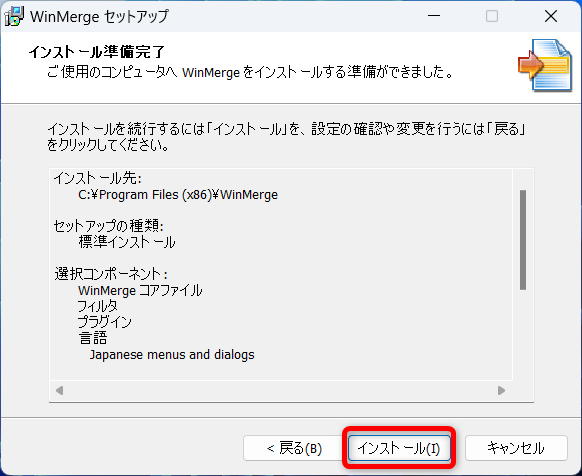

# WinMerge

## インストールの手順

### ダウンロード

下記サイトからWinMergeをダウンロードする  
https://winmerge.org/?lang=ja

`ダウンロード`フォルダに保存する

### インストール

ダウンロードしたファイルを実行  

`次へ`をクリック  

`次へ`をクリック  

`次へ`をクリック  

`次へ`をクリック  

下記にチェックを入れて`次へ`  
- システム環境変数PATHへWinMergeのフォルダを追加する
- デスクトップ上にアイコンを作成する

`インストール`をクリック  

`次へ`をクリック  

`完了`をクリック  

WinMergeが起動する  

テキストファイルの差分が確認できる

※Visual Studio Codeにも差分確認の機能があるが、こちらも便利